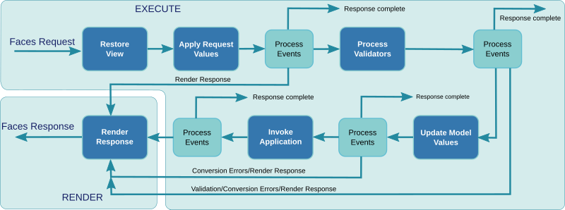

# Request Processing Lifecycle
The request lifecycle is decomposed in two groups: an execute group handles the
incoming request and a render group handles the production of the response.
The execution group is decomposed in several phases with some of them being
executed.  After each phase, some decision is made to proceed, to render the
response or finish the request when it is completed.  The request lifecycle
handles both initial requests (an HTTP GET) and postbacks (an HTTP POST).

The `Restore View` phase is always executed to handle the request and it is
responsible for building the components in the view.  The XHTML file associated
with the view is read or obtained from the facelet cache and the components
described by the XHTML tags are created to form the component tree.

The `Apply Request Values` phase is then handled to obtain the request parameters.

The `Process Validators` phase executes the input validators on the component
tree to validate the request parameters.  If a parameter is invalid, some message
can be posted and associated with the component that triggered it.

The `Update Model Values` phase invokes the `Set_Value` procedure on every
Ada bean for which an input parameter was submitted and was valid.  The Ada bean
may raise and exception and an error will be associated with the associated component.

The `Invoke Application` phase executes the Ada bean actions that have been triggered
by the `f:viewAction` for an initial requests or by the postback actions.
The Ada bean method is invoked so that it gets the control of the request and
it returns an outcome that serves for the request navigation.

The `Render Response` phase is the final phase that walks the component tree
and renders the HTML response.

