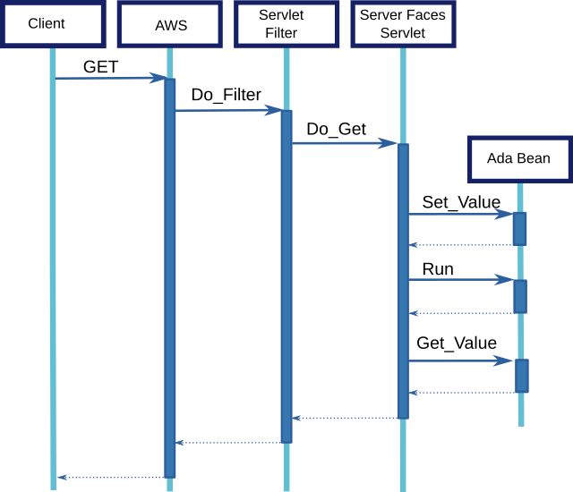

# Tutorial

[Ada Server Faces](https://github.com/stcarrez/ada-asf/) uses a model which is very close to [Java Server Faces](http://www.javaserverfaces.org/).
JSF and ASF use a component-based model for the design and implementation of a web application.
Like traditional [MVC](https://en.wikipedia.org/wiki/Model%E2%80%93view%E2%80%93controller) models, the presentation layer
is separated from the control and model parts. Unlike the MVC model, JSF and ASF are not request-based meaning there is not a specific controller
associated with the request. Instead, each component that is part of the page (view) participate in the control and each component brings a piece
of the model.

This tutorial shows how to write and use the [Ada Server Faces](https://github.com/stcarrez/ada-asf/) framework to write a simple cylinder
form computation.  The simple form has two input fields to allow entering the cylinder dimensions (the unit does not matter).
It provides a button to submit the form and obtain the result.


## View definition

The presentation part is implemented by a facelet file and a CSS file. The facelet file is an XML file
which contains XHTML elements as well as facelets and JSF/ASF components. The facelets and ASF components are specified
in their own XML namespace. The ASF components form a tree of components (__UIComponent__) which is then used for
displaying and processing form submissions.

At the root of the XML file is an `f:view` component which represents the root of the component tree.
The typical page layout looks as follows. Note the `#{contextPath}` notation in the link reference.
This is an EL expression that will be evaluated when the view is displayed (rendered in JSF terminology).

```XML
<f:view contentType="text/html"
        xmlns:ui="http://java.sun.com/jsf/facelets"
        xmlns:f="http://java.sun.com/jsf/core"
        xmlns:c="http://java.sun.com/jstl/core"
        xmlns:u="http://code.google.com/p/ada-asf/util"
        xmlns:h="http://java.sun.com/jsf/html">
 <html xmlns="http://www.w3.org/1999/xhtml">
   <head>
    <link media="screen" type="text/css" rel="stylesheet"
      href="#{contextPath}/themes/main.css"/>
    <title>Volume Cylinder</title>
   </head>
   <body>
    <div>
      <h1>Compute the volume of a cylinder</h1>
      ...
    </div>
   </body>
 </html>
</f:view>
```

The form, input fields and submit buttons have to be specified using a JSF/ASF component. The JSF/ASF component will make
the link between the presentation (view) and the controller (beans).  The `h:form` is the JSF/ASF component that
represents our form. Note that there is no need to specify any form `action` attribute: the form action will be managed by JSF/ASF.

The input fields are identified by the `h:input` components. The input field is linked to the bean through the `value` EL
expression.  This expression specifies the bean name and attribute. When rendering the view, JSF/ASF will fetch the value
from the named bean.  On form submission, JSF/ASF will populate the bean with the submitted value.

The `h:input` component can contain a `f:converter` element which indicates a conversion operation to call
when displaying or before populating the bean value.

```XML
<h:form id='compute'>
  <dl>
    <dt>Height</dt>
    <dd>
      <h:inputText id='height' size='10' value='#{compute.height}'>
        <f:converter converterId="float" />
      </h:inputText>
    </dd>
    <dt>Radius</dt>
    <dd>
        <h:inputText id='radius' size='10' value='#{compute.radius}'>
           <f:converter converterId="float"/>
        </h:inputText>
    </dd>
    <dt></dt>
    <dd>
        <h:commandButton id='run' value='Compute'
       action="#{compute.run}"/>
    </dd>
  </dl>
</h:form>
```

The `#{compute.height}` is an EL expression that refers to the `height` property of the Ada bean identified as `compute`.
The value is fetched from the Ada bean when the view is displayed and it is populated when the form is submitted.

At the form end, the `h:commandButton` represents the submit button and the controller action to invoke
on form submission.  The method to invoke is defined with an EL method expression in the `action` attribute.
Before invoking the method, JSF/ASF will verify the submitted values, convert them according to associated converters,
populate the beans with the values.

When the facelet file is instantiated, a component tree is created to describe the view and handle the request.
The component tree instantiation is specific to each request and the above facelet file will be represented by
the following simplified component tree:


The root of the component tree is the `f:view` element which is represented by a `UIView` component.  The root
component contains the `h:form` element which is represented by a `UIForm` component.  That form contains the
two `h:inputText` elements which are represented by a `UIInputText` component and they are followed by
the `h:commandButton` element represented by a `UICommandButton` component.

The page style is provided by a specific CSS file.  The `dl`/`dt`/`dd` list is rendered as a table using the following CSS definitions.
By changing the CSS file, a new presentation can be provided to users.

```
dl {
  float: left;
  width: 500px;
  border: 1px solid #bcd;
  background-color: #ffffff;
  padding: 10px;
  -moz-border-radius: 6px;
  -webkit-border-radius: 6px 6px;
}
dt {
  clear: left;
  float: left;
  font-weight: bold;
  width: 20%;
  height: 20px;
  line-height: 24px;
  padding: 5px;
}
dd {
  float: left;
  padding: 5px;
}
```

## Writing the Cylinder Ada Bean

The Ada bean is a instance of an Ada tagged record that must implement a getter and a setter operation.
These operations are invoked through an [EL expression](/index.php?post/2010/04/28/Ada-EL-The-JSR-245-Unified-Expression-Language-for-Ada).
Basically the getter is called when the view is rendered and the setter is called when the form is submitted and validated.
The `Bean` interface defines the two operations that
must be implemented by the Ada type:

```Ada
with Util.Beans.Basic;
with Util.Beans.Objects;
...
   type Compute_Bean is new Util.Beans.Basic.Bean with record
      Height : My_Float := -1.0;
      Radius : My_Float := -1.0;
   end record;

   --  Get the value identified by the name.
   overriding
   function Get_Value (From : Compute_Bean;
                       Name : String) return Util.Beans.Objects.Object;

   --  Set the value identified by the name.
   overriding
   procedure Set_Value (From  : in out Compute_Bean;
                        Name  : in String;
                        Value : in Util.Beans.Objects.Object);
```

The getter and setter will identify the property to get or set through a name.  The value is represented by an `Object`
type that can hold several data types (boolean, integer, floats,
strings, dates, ...).  The getter looks for the name and returns the corresponding value in an `Object` record.
Several `To_Object` functions helps in creating the result value.

```Ada
function Get_Value (From : Compute_Bean;
                    Name : String) return Util.Beans.Objects.Object is
begin
   if Name = "radius" and From.Radius >= 0.0 then
      return Util.Beans.Objects.To_Object (Float (From.Radius));

   elsif Name = "height" and From.Height >= 0.0 then
      return Util.Beans.Objects.To_Object (Float (From.Height));

   else
      return Util.Beans.Objects.Null_Object;
   end if;
end Get_Value;
```

The setter is similar.

```Ada
procedure Set_Value (From  : in out Compute_Bean;
                     Name  : in String;
                     Value : in Util.Beans.Objects.Object) is
begin
   if Name = "radius" then
      From.Radius := My_Float (Util.Beans.Objects.To_Float (Value));
   elsif Name = "height" then
      From.Height := My_Float (Util.Beans.Objects.To_Float (Value));
   end if;
end Set_Value;
```


## Register the Cylinder Ada Bean

The next step is to register the cylinder bean and associate it with the @@compute@@ name.
There are several ways to do that but for the purpose of this example, there will be a global instance of the bean.
That instance must be @@aliased@@ so that we can use the @@Access@@ attributes.

```Ada
 Bean  : aliased Compute_Bean;
```

The Ada bean is registered on the application object by using the @@Set_Global@@ procedure.  This creates
a global binding between a name and an @@Object@@ record. In our case, the object will hold a reference to the Ada bean.

```Ada
App : aliased ASF.Applications.Main.Application;
...
   App.Set_Global ("compute", Util.Beans.Objects.To_Object (Bean'Unchecked_Access));
```

## Command buttons and method expression

This submit button can be associated with an action that will be executed when the button is pressed.
The [EL expression|http://blog.vacs.fr/index.php?post/2010/04/28/Ada-EL-The-JSR-245-Unified-Expression-Language-for-Ada] is the mechanism by which we create a binding
between the XHTML presentation page and the component implemented in Java or Ada. A method expression is a simple EL expression that represents a bean and a method to invoke on that bean. This method expression represent our action.

A typical use is on the __h:commandButton__ component where we can specify an action to invoke when the button is pressed. This is written as:

```XML
<h:commandButton id='run' value='Compute'
       action="#{compute.run}"/>
```

The method expression `#{compute.run}` indicates to execute the method `run` of the bean identified by `compute`.

## Method Bean Declaration

Java implements method expressions by using [reflection](https://en.wikipedia.org/wiki/Reflection_(computer_programming)).
It is able to look at the methods implemented by an object and then invoke one of these method with some parameters.
Since we cannot do this in Ada, some developer help is necessary.

For this an Ada bean that implements an action must implement the `Method_Bean` interface.
If we take the `Compute_Bean` type, we just have
to extend that interface and implement the `Get_Method_Bindings` function.
This function will indicate the methods which are available for an EL expression and somehow how they can be called.

```Ada
with Util.Beans.Methods;
...
   type Compute_Bean is new Util.Beans.Basic.Bean
          and Util.Beans.Methods.Method_Bean with record
      Height : My_Float := -1.0;
      Radius : My_Float := -1.0;
      Volume: My_Float := -1.0;
   end record;
   --  This bean provides some methods that can be used in a Method_Expression
   overriding
   function Get_Method_Bindings (From : in Compute_Bean)
      return Util.Beans.Methods.Method_Binding_Array_Access;
```

Our Ada type can now define a method that can be invoked through a method expression.
The action bean always receives the bean object as an __in out__ first parameter and it must return
the action outcome as an `Unbounded_String` also as __in out__.

```Ada
 procedure Run (From    : in out Compute_Bean;
                Outcome : in out Unbounded_String);
```

## Implement the action

The implementation of our action is quite simple. The `Radius` and `Height` parameters submitted in the form
have been set on the bean before the action is called. We can use them to compute the cylinder volume.

```Ada
procedure Run (From    : in out Compute_Bean;
               Outcome : in out Unbounded_String) is
   V : My_Float;
begin
   V := (From.Radius * From.Radius);
   V := V * From.Height;
   From.Volume := V * 3.141;
   Outcome := To_Unbounded_String ("compute");
end Run;
```

## Define the action binding

To be able to call the `Run` procedure from an EL method expression, we have to create
a binding object. This binding object will hold the method name as well as a small procedure
stub that will somehow tie the method expression to the procedure.
This step is easily done by instantiating the `ASF.Events.Actions.Action_Method.Bind` package.

```Ada
with ASF.Events.Actions;
...
   package Run_Binding is
     new ASF.Events.Actions.Action_Method.Bind
        (Bean  => Compute_Bean,
         Method => Run,
         Name    => "run");
```


## Register and expose the action bindings

The last step is to implement the `Get_Method_Bindings` function. Basically it has to return an array
of method bindings which indicate the methods provided by the Ada bean. 

```Ada
Binding_Array : aliased constant Util.Beans.Methods.Method_Binding_Array
  := (Run_Binding.Proxy'Unchecked_Access, Run_Binding.Proxy'Unchecked_Access);

overriding
function Get_Method_Bindings (From : in Compute_Bean)
   return Util.Beans.Methods.Method_Binding_Array_Access is
begin
   return Binding_Array'Unchecked_Access;
end Get_Method_Bindings;
```

## What happens now?

When the user presses the __Compute__ button, the brower will submit the form and the ASF framework will do the following:

* It will check the validity of input parameters,
* It will save the input parameters on the `compute` bean by using the `Set_Value` procedure,
* It will execute the method expression `#{compute.run}`:
** It calls the `Get_Method_Bindings` function to get a list of valid method,
** Having found the right binding, it calls the binding procedure
** The binding procedure invokes the `Run` procedure on the object.


## Application Initialization

An [Ada Server Faces](https://github.com/stcarrez/ada-asf/) Application is represented by the @@Application@@ type which holds
all the information to process and dispatch requests.  First, let's declare a variable that represents
our application.

''Note: for the purpose of this article, we will assume that every variable is declared at some package level scope. If those variables are declared in another scope, the @@Access@@ attribute should be replaced by @@Unchecked_Access@@.''

```Ada
with ASF.Applications.Main;
...
   App : aliased ASF.Applications.Main.Application;
```

To initialize the application, we will also need some configuration properties and a factory object.
The configuration properties are used to configure the various components used by ASF.
The factory allows to customize some behavior of [Ada Server Faces](https://github.com/stcarrez/ada-asf/).  For now, we will use the
default factory.

```Ada
with ASF.Applications;
...
   C        : ASF.Applications.Config;
   Factory : ASF.Applications.Main.Application_Factory;
```

The initialization requires to define some configuration properties.
The @@VIEW_EXT@@ property indicates the URI extension that are recognized by ASF
to associate an XHTML file (the @@compute.html@@ corresponds to the XHTML file @@compute.xhtml@@).
The @@VIEW_DIR@@ property defines the root directory where the XHTML
files are stored.

```Ada
C.Set (ASF.Applications.VIEW_EXT, ".html");
C.Set (ASF.Applications.VIEW_DIR, "samples/web");
C.Set ("web.dir", "samples/web");
App.Initialize (C, Factory);
```

## Servlets

[Ada Server Faces](https://github.com/stcarrez/ada-asf/) uses the [Ada Servlet framework|http://blog.vacs.fr/index.php?post/2010/11/11/Ada-Servlet-Example]  to
receive and dispatch web requests. It provides a `Faces_Servlet` servlet which can be plugged in the servlet container.
This servlet is the entry point for ASF to process incoming requests. We will also need a `File_Servlet` to process
the static files. Note that these servlets are implemented using tagged records and you can easily override the entry
points (`Do_Get` or `Do_Post`) to implement specific behaviors.

```Ada
with ASF.Servlets.Faces;
with ASF.Servlets.Files;
...
   Faces : aliased ASF.Servlets.Faces.Faces_Servlet;
   Files : aliased ASF.Servlets.Files.File_Servlet;
```

The servlet instances are registered in the application.

```Ada
App.Add_Servlet (Name => "faces", Server => Faces'Access);
App.Add_Servlet (Name => "files", Server => Files'Access);
```

Once registered, we have to define a mapping that tells which URI path is mapped to the servlet. 

```Ada
App.Add_Mapping (Name => "faces", Pattern => "*.html");
App.Add_Mapping (Name => "files", Pattern => "*.css");
```


For the purpose of debugging, ASF provides a servlet filter that can be plugged in the request processing flow.
The `Dump_Filter` will produce a dump of the request with the headers and parameters.

```Ada
with ASF.Filters.Dump;
...
   Dump    : aliased ASF.Filters.Dump.Dump_Filter;
```

The filter instance is registered as follows:

```Ada
App.Add_Filter (Name => "dump", Filter => Dump'Access);
```

And a mapping is defined to tell which URL will trigger the filter.

```Ada
App.Add_Filter_Mapping (Name => "dump", Pattern => "*.html");
```

## Application and Web Container

The application object that we created is similar to a Java Web Application packaged
in a [WAR](https://en.wikipedia.org/wiki/WAR_%28Sun_file_format%29) file. It represents the application and it must
be deployed in a Web Container. With [Ada Server Faces](https://github.com/stcarrez/ada-asf/) this is almost the same, the application
needs a Web container. By default, ASF provides a web container based on the excellent 
[Ada Web Server|http://libre.adacore.com/libre/tools/aws/] implementation (other web containers could be provided in the future
based on other web servers).

```Ada
with ASF.Server.Web;
...
   WS : ASF.Server.Web.AWS_Container;
```

To register the application, we indicate the URI context path to which the application is associated.
Several applications can be registered, each of them having a unique URI context path.

```Ada
CONTEXT_PATH : constant String := "/volume";
...
WS.Register_Application (CONTEXT_PATH, App'Access);
```


## Global Objects

An application can provide some global objects which will be available during the request processing through
the [EL expression|http://blog.vacs.fr/index.php?post/2010/04/28/Ada-EL-The-JSR-245-Unified-Expression-Language-for-Ada].
First, we will expose the application context path which allows to write links in the XHTML page that match the URI used for
registering the application in the web container.

```Ada
App.Set_Global ("contextPath", CONTEXT_PATH);
```

Below is an example of use of this @@contextPath@@ variable:

```XML
<link media="screen" type="text/css" rel="stylesheet"
      href="#{contextPath}/themes/main.css"/>
```

Now, we will register the bean that we created for our application! This was explained in the
[Ada beans|http://blog.vacs.fr/index.php?post/2011/04/10/Ada-Server-Faces-Application-Example-part-2%3A-the-Ada-beans] previous article.

```Ada
with Volume;
...
   Bean    : aliased Volume.Compute_Bean;
...
   App.Set_Global ("compute", Util.Beans.Objects.To_Object (Bean'Access));
```

''Note: For the purpose of this example, the @@Compute_Bean@@ is registered as a global object. This means that it will be shared
by every request. A future article will explain how to get a session or a request bean as in Java Server Faces.''

## Starting the server

Once the application is registered, we can start our server.  Note that since [Ada Web Server|http://libre.adacore.com/libre/tools/aws/] starts several threads that listen to requests,
the @@Start@@ procedure does not block and returns as soon as the server is started. The delay is necessary
to let the server wait for requests during some time.

```Ada
WS.Start;
delay 1000.0;
```

## What happens to a request?

Let's say the server receives a HTTP GET request on `/volume/compute.html`.  Here is what happens:



* [Ada Web Server](https://libre.adacore.com/libre/tools/aws/) receives the HTTP request,
* It identifies the application that matches `/volume` (our context path) and gives the control to it,
* The application identifies the servlet that processes the remaining URI, which is `compute.html`,
* It gives the control to the `Dump_Filter` filter and then to the `Faces_Servlet` servlet,
* The faces servlet identifies the XHTML facelet file and reads the `compute.xhtml` file,
* ASF builds the component tree that describes the page and invokes the render response phase,
* While rendering, the EL expressions such as `#{compute.radius}` are evaluated and the value is obtained on our `Bean` global instance,
* The HTML content is produced as part of the rendering process and returned by AWS.


