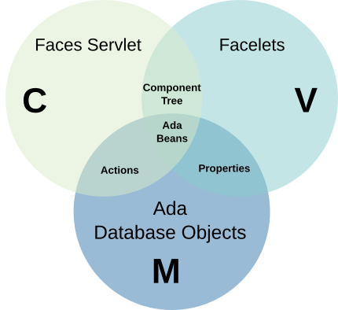

# Introduction

Ada Server Faces (ASF) is a user interface framework for Ada web applications.
It uses the same design patterns as the Java Server Faces (JSF) that is
standardized through the JSR 252, JSR 314 and JSR 344.

Ada Server Faces uses a model which is very close to [Java Server Faces](https://www.javaserverfaces.org/).
JSF and ASF use a component-based model for the design and implementation of a web application.
Like traditional [MVC](https://en.wikipedia.org/wiki/Model%E2%80%93view%E2%80%93controller) models, the presentation layer
is separated from the control and model parts. Unlike the MVC model, JSF and ASF are not request-based meaning there is not a specific controller
associated with the request. Instead, each component that is part of the page (view) participate in the control and each component brings a piece
of the model.

The Faces Servlet is the controller that handles incoming requests.  It builds a component tree from
the facelet view description files.  The component tree uses Ada beans which are instances of
Ada objects that provider a getter and a setter specific method.  The Ada bean object has
access to the application data optionally in some database.  While the component tree
is traversed and used, properties are retrieved from the model to provide values in the view
(under the control of the component tree).  For some user requests, the controller can
invoke actions and trigger some operations in the model for example to load or save some
data from the database.

The ASF framework solves a number of problems when designing and implementing
a web application:

* It provides reusable UI components to construct User interfaces,
* It defines a framework to validate the data provided by the user,
* It makes a link between the presentation layer and the Ada implementation,
* It defines a page-to-page navigation which describes the user model interactions,
* It allows the creation and building of reusable and custom UI components.

The framework is part of [Ada Web Application](https://github.com/stcarrez/ada-awa/)
framework but it can also be used as a standalone framework.

Writing an Ada Server Faces application consists in several steps:

* a set of XHTML file defines the presentation layer by describing the HTML elements of the web page,
* CSS files are written to provide a presentation design to the rendered HTML content,
* Ada beans are written to implement a link between the facelet presentation layer and the data model,
* actions are written in Ada implementation to take into account user interaction and perform work asked by the user,
* XML configuration files are written to configure the Ada Server Faces navigation rules, declare the name of Ada beans.

This document describes how to build the library and how you can use
the framework to write interactive web applications.

